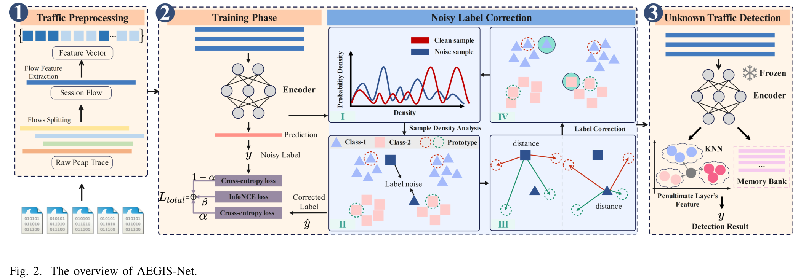

# AEGIS-Net

## Introduction

The source code and models for our paper **AEGIS-Net**.


## Framework



## Setups

All code was developed and tested on a single machine equiped with a Tesla V100 32GB GPU. The environment is as bellow:

- Ubuntu 20.04.6 LTS
- Python 3.10.13
- Pytorch 2.1.1
- faiss-gpu==1.7.2
- numpy==1.26.1
- pandas==2.1.3


## How to use

The code is currently tested only on GPU.

- Data preparation

  Preprocessing of the dataset is done at `Data_Proprecessing`.

  Created a folder `AEGIS-Net/dataset` and download `Malicious_TLS`/`CICIDS2017`/`CICIDS2017` into this folder.

  You can download these datasets for pan.baidu.com. 

  ```html
  AEGIS-Net dataset
  Link: https://pan.baidu.com/s/14dWEJquGwDoPuyt5zej4jw
  The extraction code: hrv7
  
  CIC_IDS_2017_Formated_DATA.csv is the CICIDS2017 dataset.
  processed_friday_dataset.csv is the CICIDS2018 friday dataset(2018.3.2 and 2018.2.16).
  cleaned_data is the CICDarknet2020 dataset.
  ```

- Source code

```python
# Execute the following three files in sequence
1.python training.py

2.python extract_features.py

3.python Unknown_detection.py
```


```python
# Run at different noise rate
sh training.sh
```

